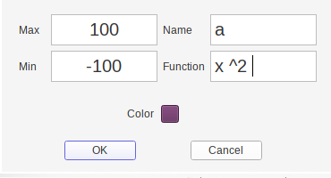
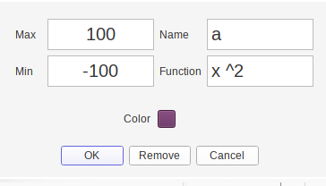
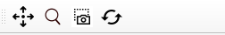
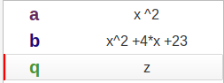
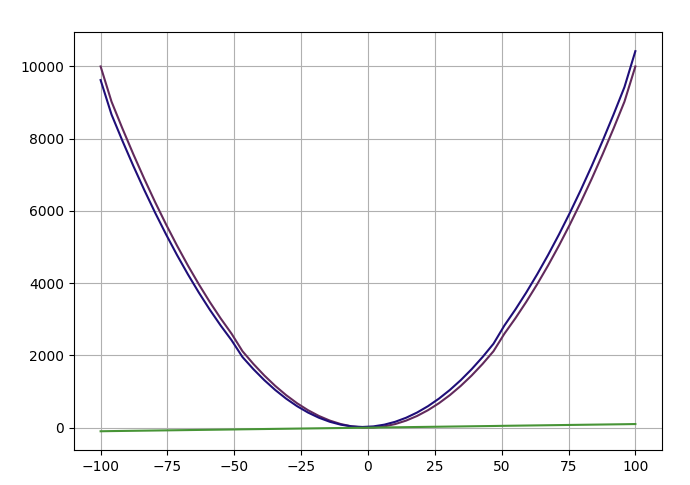

# Function Plotter 
`Task-1`: a simple Qt plotter to draw single-variables functions.

# Usage 

- Adding function from `Add` button and remove all function you insert by `Reset` button, for every function in our list you can doubleClick in any function and you can modifid it or remove it.

  
- Features of function is it's `name`, `equation` itself , `min_x`, `max_x` and curve color(and it's name color also on list).
- you have also navigator par up there you can `move` the figure or `zomm` in , take a `screen-shoot` and `home` setting

- and basic project sacing features like `save as `, `save` but here it's just a state for functions we have.

# Implementation

##GUI

- `Pyside` for GUI (official Qt for python),`GUI`backage that contain all GUI classes.
  - **MainWindow** for main window and controlling all other chilf widgets.
  - **FigureDialog** editing and adding versions for insert function figures informations (images for them are upove in usage section).
  - **FigureListWidget** widget for widget list (the figure functions list)
    
    
    
  - **CanvasFigure** canvas class and it wrapping a `matplotlip canvas` and it connected with navigation par for controlling.
    
  - **Figure** for function Figure utilities.
  - **State** for state loading and saving, all states saved in json files like:
  ```json
  {
      "figures": 
      [
        {
          "name": "a",
          "function": "x",
          "max": 100,
          "min": -100,
          "color": [96,150,67]
        },
        {
          "name": "b",
          "function": "x^2 +x +23",
          "max": 100,
          "min": -100,
          "color": [221,231,49]
        }
      ]
  }
  ```
  and from this formatting we can open anew state or save a new one.

##Function parsing and calculation
For function validator and calulating i have made a small interprater, and it's divide into these stages:
- **Tokenaization** tokanizing every char in text and check for invalided characters.
- **Parsing** parsing text recursevly to make a syntax tree with a correct operations priority,and chec for syntax error in function text. 
- **Optmization** optmizing syntax tree important in cases like: 1 * (1 +2 +3 ) + x , here we can optmaizing out tree to make recursion process in varible claculation take less time.
  
  like this optimizing:
  ```shell
  └── Token(Tokens.PLUS, '+')
      ├── Token(Tokens.PLUS, '+')
      │    ├── 1
      │    └── Token(Tokens.MUL, '*')
      │        ├── 2
      │        └── 3
      └── x
      
  └── Token(Tokens.PLUS, '+')
      ├── Token(Tokens.NUMBER, 7)
      └── x
  ```
